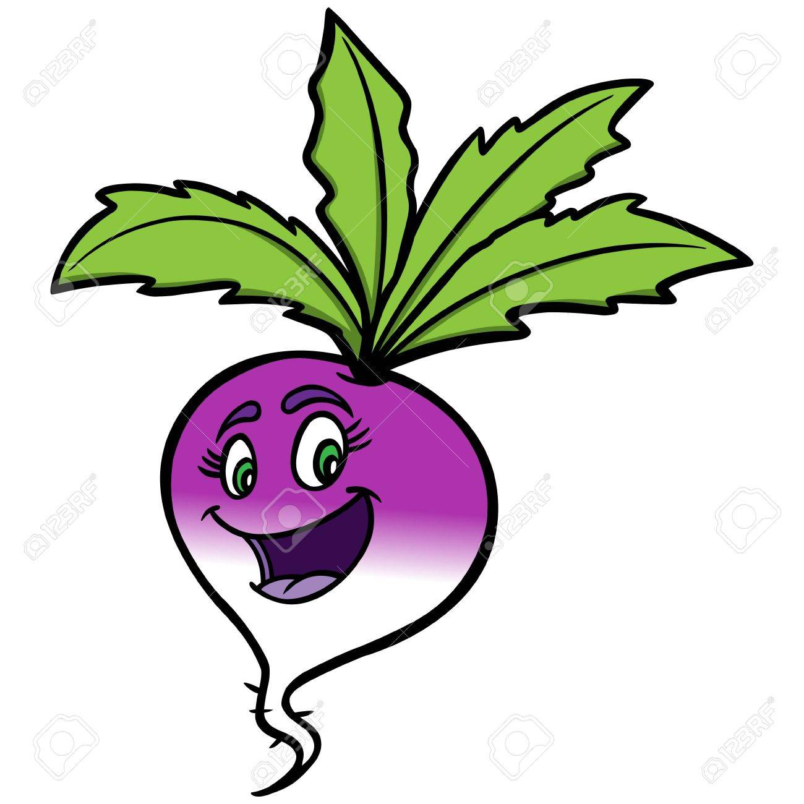
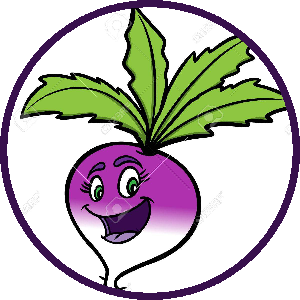

# Dammit, turnip!

A**dam**'s **mi**nimalist **t**ool **t**o p**u**t a ci**r**cle on Li**n**ked**I**n **p**rofile image, or **dammit-turnip** for short.

Python command line tool to place a circle on a LinkedIn profile image.

## Requirements
Dammit-turnip requires the [Pyhton Imaging Library (Pillow)](https://pillow.readthedocs.io) which you can install either by `pip` [(instructions here)](https://pillow.readthedocs.io/en/stable/installation.html#basic-installation) or `conda` [(instructions here)](https://anaconda.org/anaconda/pillow).

## Usage

First, clone the repository.
```
git clone https://github.com/adamlenart/dammit-turnip.git
```

Then from a terminal window run `make_circle.py`.

As a minimum, you will need to specify the input and output file paths, for example
`python3 make_circle.py img/my_input.jpg img/my_output.png` for an input image file saved `dammit-turnip\img`.

First, dammit-turnip tells you the dimension of the input image so that you can think about where to best place the circle on it.

After this, dammit-turnip will ask about what the coordinates for the center of the circle that you wish to draw, the diameter of the circle, the color of the circle and the width of the circle should be.

### Options
```
python3 make_circle.py --help

usage: make_circle.py [-h] [-x X] [-y Y] [-d D] [-R R] [-G G] [-B B] [-A A] [-width WIDTH]
                      [--resize]
                      input output

Create a circular image and draw a colored circle around its edge.

positional arguments:
  input         path to input file
  output        path to output file. The output format must be PNG.

optional arguments:
  -h, --help    show this help message and exit
  -x X          integer, x coordinate of the center of the circle. 0 is left.
  -y Y          integer, y coordinate of the center of the circle. 0 is top.
  -d D          integer, diameter of the circle in pixels.
  -R R          integer, R in RGBA color specifications, e.g., 150 in "(150,0,100,255)".
  -G G          integer, G in RGBA color specifications, e.g., 0 in "(150,0,100,255)".
  -B B          integer, B in RGBA color specifications, e.g., 100 in "(150,0,100,255)".
  -A A          integer, A in RGBA color specifications, e.g., 255 in "(150,0,100,255)".
  -width WIDTH  integer, width of circle line in pixels.
  --resize      Add to arguments to resize to 300 x 300 pixels.
```

### Skip interactive mode to save time

However, if you would like to skip the interactive questions, you can also run
```
python3 make_circle.py img/turnip.jpg img/fancy_turnip.png -x 600 -y 600 -d 1200 -R 56 -G 16 -B 77 -A 255 -width 30 --resize
```
which will render our original image 

to

 

## FAQ

### How do I know the RGBA components of the color?
RGBA stands for Red-Green-Blue-Alpha. To identify the values of the respective color channels, you could use a [color picker](https://imagecolorpicker.com/) and set the alpha from 0 (transparent) to 255 (solid) color.


